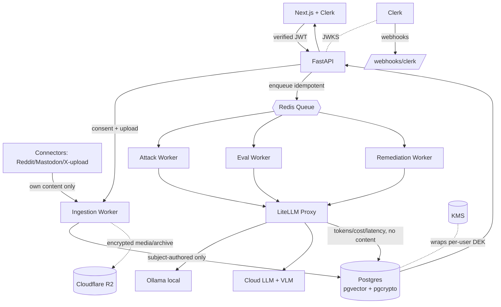

# Architecture — System Overview

> **Dependencies** (see `00-traceability.md`)
> - **Depends on:** `archive/architecture.md` (the flat source this splits/supersedes), `01-product/scope-v1.md`, `04-ai-engine/llm-gateway.md` + `overview.md`, `CLAUDE.md` (locked decisions)
> - **Consumed by:** `trust-boundaries.md`, `deployment-topology.md`, `05-backend/*`, `03-data/*`, `09-infra-devops/*`
> - **Hard invalidations:** adding/removing a component or modality → update `trust-boundaries`, `deployment-topology`, the DB tables, and the gateway config
> - **Version:** v1 (reconciled: **+LiteLLM Proxy**, **+VLM path**, **+connectors**, **+media/EXIF** — supersedes `archive/architecture.md` Components/Diagram)

Cloud, service-oriented, async-first.

## Components
| Layer | Component | Responsibility |
|---|---|---|
| Client | Next.js + Clerk | Upload/connect, consent, dashboard, attribution + defend simulation |
| Edge | Clerk | Identity; issues session JWTs (verified via JWKS) |
| API | FastAPI | Verify JWT, RBAC, orchestrate runs, serve results, export/erasure |
| Webhooks | `/webhooks/clerk` | `user.created/deleted`, membership sync |
| **Connectors** | read-only OAuth pollers | **Reddit, Mastodon (live); X upload-first** — pull the user's *own* content |
| Async | Redis + `arq` | Queue for all long-running model work |
| Workers | ingestion / attack / eval / remediation / purge | Stage execution + retention |
| **LiteLLM Proxy** | self-hosted Docker gateway | **Single OpenAI-compatible control plane** to all model backends; budget caps, routing, separation assertion; **no content logging** |
| Model backends | Ollama (local/dev) · cloud **LLM + VLM** (cited) | Run the model slots (`feasibility-and-cost.md`) |
| Data | Postgres + pgvector + pgcrypto | Primary store, embeddings, field-level encryption; **+media_assets / exif_findings / connected_accounts / calibration** |
| Object storage | **Cloudflare R2** *(optional)* | App-side-encrypted media/archives, or process-then-discard |
| Security | KMS | Wraps per-user DEKs; enables crypto-shred |

## Diagram

The LiteLLM Proxy *routes*; Ollama/cloud *run* the models. Only the model call leaves the network (`trust-boundaries.md`).
