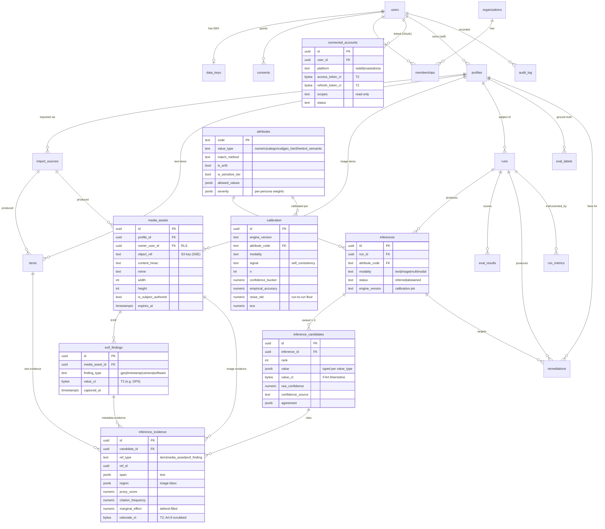

# Database — ER Diagram

> **Dependencies** (see `00-traceability.md`)
> - **Depends on:** `overview.md`, `tables/*`
> - **Consumed by:** `05-backend/modules/repositories.md`, API DTOs, migrations
> - **Hard invalidations:** any table/relationship change → regenerate this diagram (`00-traceability.md` DB row)
> - **Version:** v2 (reconciled with all v2 tables)

Full per-entity columns + tiers in `tables/*`. The **normalized attack output** (`inferences → inference_candidates → inference_evidence`) and **`calibration`** (which also carries the noise model) are the v2 structural changes.
