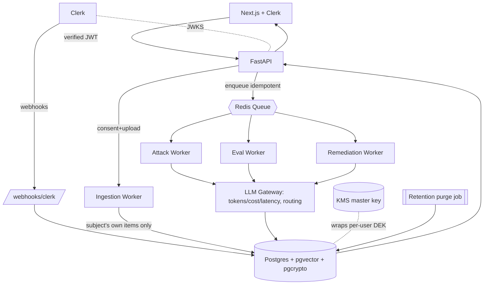

# Inference Exposure Auditor — Final System & Database Design (v2)

Supersedes v1. Locked decisions: **cloud** backend · **Clerk** auth · **RBAC** (orgs + roles, shaped for the exec/enterprise extension) · **pgcrypto** encryption · **async-from-start** · subjects = self-audit + SynthPAI only.

---

## 0. Review findings — what changed from v1 and why

| # | Issue in v1 | Severity | Fix in v2 |
|---|---|---|---|
| 1 | `users.id` was a self-minted UUID; Clerk owns identity | High | Key off `clerk_user_id`; verify Clerk JWT via JWKS; `user.deleted` webhook → erasure |
| 2 | No RBAC model | High | `organizations`, `memberships`, role enum + `role_permissions` matrix; enforced in API **and** RLS |
| 3 | Encryption left as "TBD pgcrypto" | High | Per-user DEK (envelope, KMS-wrapped) + pgcrypto with **bound-parameter-only** keys; `SECURITY DEFINER` decrypt fn |
| 4 | Embeddings classified as Tier-1 "safe" | Med | Reclassified: embeddings are **invertible personal data**; deleted via cascade, never treated as anonymous |
| 5 | Special-category inference outputs stored as plain Tier-1 | High | Encrypt special-category `predicted_value`; require **explicit Art. 9 consent** |
| 6 | No retention / storage-limitation mechanism | Med | `expires_at` + scheduled purge job |
| 7 | Async runs lacked lifecycle/idempotency | Med | Run state machine, `idempotency_key`, retries, dead-letter |
| 8 | `content_hash` was a plain hash (weak identifier) | Low | Keyed **HMAC** for dedupe |
| 9 | Audit log mutability unstated | Med | Append-only (no UPDATE/DELETE grant); retained under legal-obligation basis |
| 10 | No DPIA / sub-processor acknowledgment | Med | High-risk profiling → DPIA artifact; cloud LLM = sub-processor in DPA/policy |

---

## 1. Identity & access control (Clerk + RBAC)

**Authentication.** Clerk is the IdP. The Next.js app gets a Clerk session; FastAPI verifies the Clerk-issued JWT against Clerk's **JWKS** on every request. We never trust a client-supplied `user_id` — it comes only from the verified token's `sub` (the `clerk_user_id`).

**Tenancy.** Use **Clerk Organizations** as the tenancy primitive (this is what makes the exec/enterprise extension a no-migration step). v1 self-audit runs in a personal scope (a personal org or null-org default); the schema is org-ready from day one. *(Verify current Clerk Organizations/roles API shape against their docs when wiring.)*

**RBAC.** Roles are coarse and permission-checked:

| Role | Intended use | Key permissions |
|---|---|---|
| `owner` | account/org owner | all, incl. billing, delete-org |
| `admin` | org admin | manage members, run analyses, view all subjects |
| `analyst` | exec-protection operator (future) | run analyses, view assigned subjects |
| `viewer` | read-only | view results only |

For v1 self-audit, the user is `owner` of a personal org over their own profile — light enforcement, full model in place. Permissions are a static matrix (`role_permissions`) checked in a FastAPI dependency **and** mirrored into RLS via session GUCs (§4).

**Lifecycle webhooks.** Clerk → `/webhooks/clerk`: `user.created` (provision row), `user.deleted` (trigger erasure + crypto-shred), `organizationMembership.*` (sync `memberships`).

---

## 2. System architecture



**Async run lifecycle (state machine):**
`queued → running → succeeded | failed | canceled`, with `attempts`, exponential-backoff retries, and a dead-letter path on terminal failure. Enqueue is **idempotent** via `runs.idempotency_key`. The client creates a run (`202 Accepted` + `run_id`) and polls `GET /runs/{id}` (or subscribes via SSE).

**Trust boundaries / sub-processors:** the **LLM gateway** is the only egress of (decrypted, in-memory) content to a cloud LLM — it's a documented sub-processor in the DPA/privacy policy. Everything else stays inside the VPC.

---

## 3. Encryption & key handling (pgcrypto, done correctly)

**Envelope model.** Each user has a Data Encryption Key (DEK). The DEK is stored only **wrapped** by a KMS master key (`data_keys.wrapped_dek`). At request time the app unwraps the DEK in memory (via KMS), then passes it to pgcrypto.

**pgcrypto protocol (the part people get wrong):**
- Encrypt/decrypt with `pgp_sym_encrypt(text, dek)` / `pgp_sym_decrypt(bytea, dek)`.
- The DEK is **always a bound query parameter**, never string-interpolated into SQL — otherwise it lands in `log_statement` / `pg_stat_statements`.
- Decryption is exposed only through a `SECURITY DEFINER` function owned by a privileged role; the app role cannot `SELECT` raw key material or read `data_keys`.
- `log_statement = 'none'` (or filtered) on the decrypt path; no decrypted content is ever logged.

**Crypto-shredding.** Erasure = cascade-delete the user's rows **and** delete `data_keys` → all T2 ciphertext (including in backups) is permanently unrecoverable. This is what makes "right to erasure" provable without chasing copies.

**What gets encrypted (T2):** `items.text`, `inferences.reasoning`, `inferences.predicted_value` **when the attribute is special-category**, and `remediations.original/rewritten`. Dedupe uses a **keyed HMAC** (`content_hmac`), not a plain hash, so it can't be used as a content-lookup oracle.

---

## 4. Storage tiers (corrected)

| Tier | Data | Handling |
|---|---|---|
| **T1 — derived** | metrics, eval scores, non-sensitive `predicted_value`/`top3`, run status | stored plaintext; cascade-deleted on erasure |
| **T1′ — derived but invertible** | `items.embedding` | **personal data**; not encrypted but cascade-deleted; never treated as anonymous |
| **T2 — raw / sensitive, consented** | `items.text`, `reasoning`, special-category outputs, remediation text, archive | pgcrypto-encrypted, hard-deletable, `expires_at` retention |
| **T3 — never persisted** | other people's content in pulled threads; any non-consenting third party | dropped at ingestion |
| **Synthetic** | SynthPAI | `profiles.type='synthpai'`, `user_id/org_id` NULL; not encrypted; exempt from erasure |

---

## 5. Final schema (DDL)

```sql
CREATE EXTENSION IF NOT EXISTS pgcrypto;
CREATE EXTENSION IF NOT EXISTS vector;

-- ========= Identity, tenancy, RBAC =========
CREATE TABLE users (
  id             uuid PRIMARY KEY DEFAULT gen_random_uuid(),
  clerk_user_id  text UNIQUE NOT NULL,          -- source of identity (JWT sub)
  email          text,                          -- synced from Clerk (convenience)
  created_at     timestamptz NOT NULL DEFAULT now()
);

CREATE TABLE organizations (
  id             uuid PRIMARY KEY DEFAULT gen_random_uuid(),
  clerk_org_id   text UNIQUE,                    -- NULL = personal scope
  name           text,
  created_at     timestamptz NOT NULL DEFAULT now()
);

CREATE TYPE role_t AS ENUM ('owner','admin','analyst','viewer');

CREATE TABLE memberships (
  id        uuid PRIMARY KEY DEFAULT gen_random_uuid(),
  user_id   uuid NOT NULL REFERENCES users(id) ON DELETE CASCADE,
  org_id    uuid NOT NULL REFERENCES organizations(id) ON DELETE CASCADE,
  role      role_t NOT NULL DEFAULT 'owner',
  UNIQUE (user_id, org_id)
);

CREATE TABLE permissions ( code text PRIMARY KEY, description text );
CREATE TABLE role_permissions (
  role role_t NOT NULL,
  permission_code text NOT NULL REFERENCES permissions(code),
  PRIMARY KEY (role, permission_code)
);

-- ========= Keys, consent =========
CREATE TABLE data_keys (                         -- crypto-shred target; app role CANNOT read
  user_id     uuid PRIMARY KEY REFERENCES users(id) ON DELETE CASCADE,
  wrapped_dek bytea NOT NULL,
  kms_key_id  text  NOT NULL,
  created_at  timestamptz NOT NULL DEFAULT now()
);

CREATE TABLE consents (
  id              uuid PRIMARY KEY DEFAULT gen_random_uuid(),
  user_id         uuid NOT NULL REFERENCES users(id) ON DELETE CASCADE,
  purpose         text NOT NULL,                 -- 'self_audit_inference'
  special_category boolean NOT NULL DEFAULT false,-- Art. 9 explicit consent
  policy_version  text NOT NULL,
  granted_at      timestamptz NOT NULL DEFAULT now(),
  revoked_at      timestamptz
);

-- ========= Subjects (unifies self + SynthPAI) =========
CREATE TABLE profiles (
  id            uuid PRIMARY KEY DEFAULT gen_random_uuid(),
  type          text NOT NULL CHECK (type IN ('self','synthpai')),
  user_id       uuid REFERENCES users(id) ON DELETE CASCADE,
  org_id        uuid REFERENCES organizations(id) ON DELETE CASCADE,
  external_ref  text,
  label         text,
  CHECK ( (type = 'synthpai' AND user_id IS NULL)
       OR (type = 'self'     AND user_id IS NOT NULL) )
);

-- ========= Ingestion =========
CREATE TABLE import_sources (
  id            uuid PRIMARY KEY DEFAULT gen_random_uuid(),
  owner_user_id uuid REFERENCES users(id) ON DELETE CASCADE,   -- denormalized for RLS
  profile_id    uuid NOT NULL REFERENCES profiles(id) ON DELETE CASCADE,
  platform      text NOT NULL,
  method        text NOT NULL CHECK (method IN ('upload','api','seed')),
  file_ref      text,
  status        text NOT NULL DEFAULT 'pending',
  imported_at   timestamptz NOT NULL DEFAULT now()
);

CREATE TABLE items (
  id                  uuid PRIMARY KEY DEFAULT gen_random_uuid(),
  owner_user_id       uuid REFERENCES users(id) ON DELETE CASCADE,  -- RLS; NULL for synthpai
  profile_id          uuid NOT NULL REFERENCES profiles(id) ON DELETE CASCADE,
  import_source_id    uuid REFERENCES import_sources(id) ON DELETE CASCADE,
  platform            text NOT NULL,
  author_handle       text,
  created_at          timestamptz,
  text_ct             bytea NOT NULL,            -- T2: pgp_sym_encrypt
  content_hmac        text,                      -- keyed dedupe
  embedding           vector(1536),              -- T1′: invertible, cascade-deleted
  is_subject_authored boolean NOT NULL,          -- T3 dropped before insert
  expires_at          timestamptz,               -- retention
  ingested_at         timestamptz NOT NULL DEFAULT now()
);

-- ========= Attribute taxonomy =========
CREATE TABLE attributes (
  code                text PRIMARY KEY,          -- 'location','income','sex',...
  label               text NOT NULL,
  is_special_category boolean NOT NULL DEFAULT false
);

-- ========= Runs (attack | eval | remediation) =========
CREATE TYPE run_status_t AS ENUM ('queued','running','succeeded','failed','canceled');

CREATE TABLE runs (
  id              uuid PRIMARY KEY DEFAULT gen_random_uuid(),
  owner_user_id   uuid REFERENCES users(id) ON DELETE CASCADE,
  profile_id      uuid NOT NULL REFERENCES profiles(id) ON DELETE CASCADE,
  type            text NOT NULL CHECK (type IN ('attack','eval','remediation')),
  model           text NOT NULL,
  params          jsonb,
  status          run_status_t NOT NULL DEFAULT 'queued',
  attempts        int NOT NULL DEFAULT 0,
  idempotency_key text UNIQUE,
  error           text,
  started_at      timestamptz,
  finished_at     timestamptz
);

CREATE TABLE inferences (
  id                 uuid PRIMARY KEY DEFAULT gen_random_uuid(),
  owner_user_id      uuid REFERENCES users(id) ON DELETE CASCADE,
  run_id             uuid NOT NULL REFERENCES runs(id) ON DELETE CASCADE,
  profile_id         uuid NOT NULL REFERENCES profiles(id) ON DELETE CASCADE,
  attribute_code     text NOT NULL REFERENCES attributes(code),
  predicted_value    text,        -- plaintext ONLY for non-special-category
  predicted_value_ct bytea,       -- T2: encrypted when special-category
  top3               jsonb,
  confidence         numeric(4,3),
  hardness           int,
  reasoning_ct       bytea,       -- T2: may echo quasi-identifiers
  evidence_item_ids  jsonb,
  created_at         timestamptz NOT NULL DEFAULT now()
);

-- ========= Measure =========
CREATE TABLE eval_labels (
  id             uuid PRIMARY KEY DEFAULT gen_random_uuid(),
  profile_id     uuid NOT NULL REFERENCES profiles(id) ON DELETE CASCADE,
  attribute_code text NOT NULL REFERENCES attributes(code),
  true_value     text NOT NULL,
  source         text NOT NULL DEFAULT 'synthpai'
);

CREATE TABLE eval_results (
  id             uuid PRIMARY KEY DEFAULT gen_random_uuid(),
  run_id         uuid NOT NULL REFERENCES runs(id) ON DELETE CASCADE,
  attribute_code text NOT NULL REFERENCES attributes(code),
  n              int NOT NULL,
  top1_acc       numeric(4,3),
  top3_acc       numeric(4,3),
  computed_at    timestamptz NOT NULL DEFAULT now()
);

-- ========= Defend =========
CREATE TABLE remediations (
  id                uuid PRIMARY KEY DEFAULT gen_random_uuid(),
  owner_user_id     uuid REFERENCES users(id) ON DELETE CASCADE,
  profile_id        uuid NOT NULL REFERENCES profiles(id) ON DELETE CASCADE,
  item_id           uuid REFERENCES items(id) ON DELETE CASCADE,
  attribute_code    text REFERENCES attributes(code),
  action            text NOT NULL CHECK (action IN ('rewrite','remove')),
  original_ct       bytea,       -- T2
  rewritten_ct      bytea,       -- T2
  confidence_before numeric(4,3),
  confidence_after  numeric(4,3),
  run_id            uuid REFERENCES runs(id) ON DELETE SET NULL,
  created_at        timestamptz NOT NULL DEFAULT now()
);

-- ========= Observability + compliance =========
CREATE TABLE run_metrics (
  id                uuid PRIMARY KEY DEFAULT gen_random_uuid(),
  run_id            uuid NOT NULL REFERENCES runs(id) ON DELETE CASCADE,
  model             text NOT NULL,
  prompt_tokens     int,
  completion_tokens int,
  latency_ms        int,
  cost_usd          numeric(10,6),
  created_at        timestamptz NOT NULL DEFAULT now()
);

CREATE TABLE audit_log (                          -- append-only (no UPDATE/DELETE grant)
  id         uuid PRIMARY KEY DEFAULT gen_random_uuid(),
  user_id    uuid REFERENCES users(id) ON DELETE SET NULL,
  action     text NOT NULL,
  detail     jsonb,
  created_at timestamptz NOT NULL DEFAULT now()
);
```

**Indexes**
```sql
CREATE INDEX ON items (profile_id);
CREATE INDEX ON items (owner_user_id);
CREATE INDEX ON items USING hnsw (embedding vector_cosine_ops);
CREATE INDEX ON inferences (run_id);
CREATE INDEX ON inferences (profile_id, attribute_code);
CREATE INDEX ON eval_labels (profile_id, attribute_code);
CREATE INDEX ON runs (status);
CREATE INDEX ON run_metrics (run_id);
```

---

## 6. Row-Level Security (tenant isolation)

Per request, after JWT verification, the API sets session GUCs and lets Postgres enforce isolation as defense-in-depth:

```sql
-- set from the verified Clerk token, per transaction
SET LOCAL app.user_id = '<users.id>';
SET LOCAL app.org_id  = '<organizations.id>';

ALTER TABLE items ENABLE ROW LEVEL SECURITY;
CREATE POLICY items_tenant ON items
  USING ( owner_user_id = current_setting('app.user_id', true)::uuid
          OR profile_id IN (SELECT id FROM profiles WHERE type = 'synthpai') );
-- analogous policies on runs, inferences, remediations, import_sources, run_metrics
```

`data_keys` has **no** policy granting the app role read access; only the `SECURITY DEFINER` decrypt function touches it.

---

## 7. Compliance protocol checklist

| Control | Where | Status target for v1 |
|---|---|---|
| Lawful basis = explicit consent (Art. 6 + Art. 9 for special category) | `consents` | required before any run |
| Data minimization (subject's own items only) | ingestion | enforced (`is_subject_authored`) |
| Storage limitation / retention | `items.expires_at` + purge job | implemented |
| Right to access (DSAR export) | `/account/export` | implemented |
| Right to erasure + crypto-shred | cascade + `data_keys` delete | implemented |
| Encryption at rest (managed PG) + field-level (pgcrypto) | infra + DB | implemented |
| Audit trail (append-only) | `audit_log` | implemented |
| Sub-processor disclosure (cloud LLM) | DPA / privacy policy | **policy artifact** |
| DPIA (high-risk profiling) | document | **policy artifact** |
| Breach response process | runbook | **policy artifact** |

The three "policy artifacts" are non-code deliverables — worth listing in the README so a privacy-minded reviewer (e.g., redact) sees you know they exist.

---

## 8. Next: API surface (with authz)

Endpoints fall out of the model; each is permission-checked and tenant-scoped:

- `POST /imports` · `GET /imports/{id}`
- `POST /runs` (type: attack|eval|remediation, idempotent) · `GET /runs/{id}`
- `GET /profiles/{id}/inferences` · `GET /profiles/{id}/remediations`
- `GET /eval/results`
- `GET /account/export` · `DELETE /account` (erasure)
- `POST /webhooks/clerk`

Each maps to a `permissions` code (e.g., `run:create`, `subject:read`) checked in a FastAPI dependency and backed by RLS.
