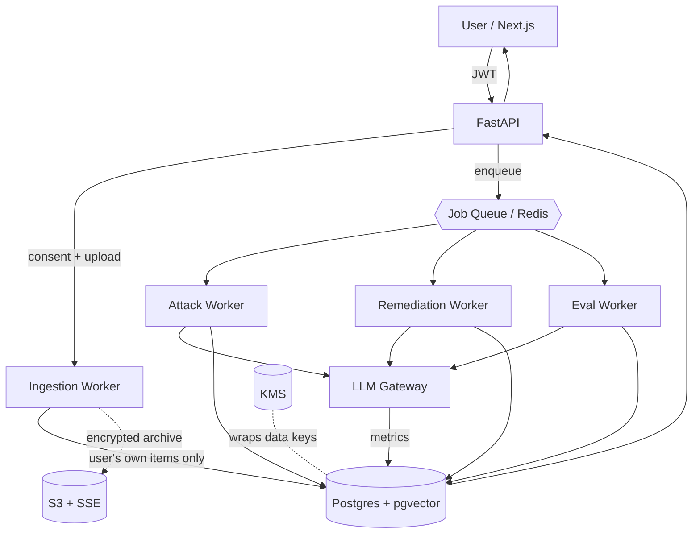

# Inference Exposure Auditor — System Architecture & Database Schema

**Decisions locked:** cloud-based backend · self-audit + SynthPAI subjects only · user's own raw content persisted **encrypted** · no arbitrary third-party profiles in v1.

These choices mean the *only* real data subject is the consenting user analyzing themselves, and the eval set (SynthPAI) has no data subjects at all. That removes nearly all GDPR/CCPA exposure before we write a single table.

---

## 1. System architecture (cloud)

### Components

| Layer | Component | Responsibility |
|---|---|---|
| Client | **Next.js** app | Upload/connect, consent capture, dashboard, attribution heatmap, attack→defend simulation |
| Edge | **Auth** (Clerk/Auth0/NextAuth → JWT) | Identity; every request scoped to `user_id` |
| API | **FastAPI** | REST endpoints, run orchestration, results, exports/deletes |
| Async | **Job queue** (arq/RQ/Celery + Redis) | LLM runs are slow → all attack/eval/remediation jobs run async |
| Workers | **Ingestion** | Parse exports → normalize → keep only the subject's own items, drop third-party content |
| Workers | **Inference (Attack)** | Per-attribute inference via LLM gateway → `inferences` |
| Workers | **Remediation (Defend)** | Adversarial rewrite + re-attack → `remediations` |
| Workers | **Eval (Measure)** | Run engine on SynthPAI → compare to labels → `eval_results` |
| Service | **LLM gateway** | Single abstraction over the LLM (e.g., Claude); records tokens/cost/latency; model routing |
| Data | **Postgres + pgvector** | Primary store; encryption at rest + column encryption for raw content |
| Data | **Object storage** (S3 + SSE) *(optional)* | Encrypted original archive files; or process-then-discard |
| Security | **KMS** | Master key for envelope encryption + crypto-shredding |

### Diagram



### Data flow — the three stages
- **Attack:** upload → consent → ingest (user items, encrypted) → enqueue `attack` run → inference per attribute → `inferences` (+ `run_metrics`) → dashboard.
- **Measure:** SynthPAI loaded once → `eval` run over synthetic profiles → compare to `eval_labels` → `eval_results` (your headline accuracy).
- **Defend:** user triggers `remediation` run → anonymizer rewrites/flags items → **re-attack** → store `confidence_before`/`confidence_after` → simulation view shows the delta.

---

## 2. The three-tier legal storage model

| Tier | What | Tables | Rule |
|---|---|---|---|
| **T1 — Derived (safe)** | Inference results, metrics, eval scores, embeddings | `inferences`*, `eval_results`, `run_metrics`, `items.embedding` | Store freely; subject is the consenting user. (*`reasoning` may echo quasi-identifiers → encrypt, see below.) |
| **T2 — Raw, consented** | The user's own posts + remediation text + uploaded archive | `items.text`, `remediations.original/rewritten`, S3 archive | Encrypt at rest, scope to user, hard-deletable, retention-limited |
| **T3 — Never persist** | Content authored by *other* people in pulled threads; any inference about a non-consenting third party | — | Dropped at ingestion (`is_subject_authored = false` → discard) |

**SynthPAI** is the clean exception: fully synthetic, MIT-licensed, no data subjects. It lives in the DB as `profiles.type = 'synthpai'`, is exempt from user-deletion, and can be stored without encryption.

---

## 3. Encryption & deletion design

- **Envelope encryption.** Each user has a Data Encryption Key (DEK) stored only as ciphertext (`data_keys.wrapped_dek`), wrapped by a KMS master key. T2 columns are stored as `bytea` ciphertext (AES-GCM) using the user's DEK. (Simplest path for v1: Postgres `pgcrypto`; production: app-layer AES-GCM + KMS.)
- **Crypto-shredding.** Account deletion = cascade-delete user rows **and** destroy the user's DEK → any residual T2 ciphertext (e.g., in backups) is permanently unrecoverable. This makes "right to erasure" cheap and provable.
- **Consent as lawful basis.** `consents` records purpose + policy version + timestamp at upload; revocation timestamped. Backs GDPR Art. 6/9 and is auditable.
- **Special-category flag.** `attributes.is_special_category` marks inferences that are GDPR special-category (e.g., sex, and arguably others) so the UI can warn and you can apply stricter handling.
- **Audit + DSAR.** `audit_log` records exports, deletes, consent changes → supports data-subject access/erasure requests.
- **Row scoping.** Every query filtered by `user_id`; optionally enforce Postgres **Row-Level Security** so a bug can't cross tenants.

---

## 4. Database schema

```sql
-- ===== Identity, consent, keys =====
CREATE TABLE users (
  id            uuid PRIMARY KEY DEFAULT gen_random_uuid(),
  email         text UNIQUE NOT NULL,
  created_at    timestamptz NOT NULL DEFAULT now()
);

CREATE TABLE data_keys (              -- envelope encryption (crypto-shred target)
  user_id       uuid PRIMARY KEY REFERENCES users(id) ON DELETE CASCADE,
  wrapped_dek   bytea NOT NULL,       -- DEK encrypted by KMS master key
  kms_key_id    text  NOT NULL,
  created_at    timestamptz NOT NULL DEFAULT now()
);

CREATE TABLE consents (
  id            uuid PRIMARY KEY DEFAULT gen_random_uuid(),
  user_id       uuid NOT NULL REFERENCES users(id) ON DELETE CASCADE,
  purpose       text NOT NULL,         -- e.g. 'self_audit_inference'
  policy_version text NOT NULL,
  granted_at    timestamptz NOT NULL DEFAULT now(),
  revoked_at    timestamptz
);

-- ===== Subjects: unify self-audit + SynthPAI through one pipeline =====
CREATE TABLE profiles (
  id            uuid PRIMARY KEY DEFAULT gen_random_uuid(),
  type          text NOT NULL CHECK (type IN ('self','synthpai')),
  user_id       uuid REFERENCES users(id) ON DELETE CASCADE,  -- NULL for synthpai
  external_ref  text,                  -- SynthPAI profile id, if synthetic
  label         text
);

-- ===== Ingestion =====
CREATE TABLE import_sources (
  id            uuid PRIMARY KEY DEFAULT gen_random_uuid(),
  user_id       uuid REFERENCES users(id) ON DELETE CASCADE,
  profile_id    uuid NOT NULL REFERENCES profiles(id) ON DELETE CASCADE,
  platform      text NOT NULL,          -- 'x','reddit','takeout','synthpai'
  method        text NOT NULL CHECK (method IN ('upload','api','seed')),
  file_ref      text,                   -- encrypted S3 key, nullable
  status        text NOT NULL DEFAULT 'pending',
  imported_at   timestamptz NOT NULL DEFAULT now()
);

CREATE TABLE items (
  id                 uuid PRIMARY KEY DEFAULT gen_random_uuid(),
  profile_id         uuid NOT NULL REFERENCES profiles(id) ON DELETE CASCADE,
  import_source_id   uuid REFERENCES import_sources(id) ON DELETE CASCADE,
  platform           text NOT NULL,
  author_handle      text,
  created_at         timestamptz,             -- original post time
  text_ciphertext    bytea NOT NULL,          -- T2: AES-GCM (synthpai: system key)
  text_iv            bytea NOT NULL,
  content_hash       text,                    -- dedupe without decrypting
  embedding          vector(1536),            -- T1: derived
  is_subject_authored boolean NOT NULL,       -- T3 dropped before insert (kept = true)
  ingested_at        timestamptz NOT NULL DEFAULT now()
);

-- ===== Attribute taxonomy (the 8 PAI attributes) =====
CREATE TABLE attributes (
  code               text PRIMARY KEY,        -- 'location','income','sex',...
  label              text NOT NULL,
  is_special_category boolean NOT NULL DEFAULT false
);

-- ===== Runs: attack | eval | remediation =====
CREATE TABLE runs (
  id            uuid PRIMARY KEY DEFAULT gen_random_uuid(),
  profile_id    uuid NOT NULL REFERENCES profiles(id) ON DELETE CASCADE,
  type          text NOT NULL CHECK (type IN ('attack','eval','remediation')),
  model         text NOT NULL,
  params        jsonb,
  status        text NOT NULL DEFAULT 'queued',
  started_at    timestamptz,
  finished_at   timestamptz
);

CREATE TABLE inferences (
  id                 uuid PRIMARY KEY DEFAULT gen_random_uuid(),
  run_id             uuid NOT NULL REFERENCES runs(id) ON DELETE CASCADE,
  profile_id         uuid NOT NULL REFERENCES profiles(id) ON DELETE CASCADE,
  attribute_code     text NOT NULL REFERENCES attributes(code),
  predicted_value    text,
  top3               jsonb,
  confidence         numeric(4,3),
  hardness           int,
  reasoning_ciphertext bytea,                 -- T2: may echo quasi-identifiers
  reasoning_iv       bytea,
  evidence_item_ids  jsonb,                    -- which items leaked it
  created_at         timestamptz NOT NULL DEFAULT now()
);

-- ===== Measure: ground truth + scores =====
CREATE TABLE eval_labels (                     -- SynthPAI human-verified labels
  id            uuid PRIMARY KEY DEFAULT gen_random_uuid(),
  profile_id    uuid NOT NULL REFERENCES profiles(id) ON DELETE CASCADE,
  attribute_code text NOT NULL REFERENCES attributes(code),
  true_value    text NOT NULL,
  source        text NOT NULL DEFAULT 'synthpai'
);

CREATE TABLE eval_results (
  id            uuid PRIMARY KEY DEFAULT gen_random_uuid(),
  run_id        uuid NOT NULL REFERENCES runs(id) ON DELETE CASCADE,
  attribute_code text NOT NULL REFERENCES attributes(code),
  n             int NOT NULL,
  top1_acc      numeric(4,3),
  top3_acc      numeric(4,3),
  computed_at   timestamptz NOT NULL DEFAULT now()
);

-- ===== Defend: rewrite/remove + before/after proof =====
CREATE TABLE remediations (
  id                 uuid PRIMARY KEY DEFAULT gen_random_uuid(),
  profile_id         uuid NOT NULL REFERENCES profiles(id) ON DELETE CASCADE,
  item_id            uuid REFERENCES items(id) ON DELETE CASCADE,
  attribute_code     text REFERENCES attributes(code),
  action             text NOT NULL CHECK (action IN ('rewrite','remove')),
  original_ciphertext  bytea,                  -- T2
  rewritten_ciphertext bytea,                  -- T2
  iv                 bytea,
  confidence_before  numeric(4,3),
  confidence_after   numeric(4,3),
  run_id             uuid REFERENCES runs(id) ON DELETE SET NULL,
  created_at         timestamptz NOT NULL DEFAULT now()
);

-- ===== Observability + compliance =====
CREATE TABLE run_metrics (
  id                uuid PRIMARY KEY DEFAULT gen_random_uuid(),
  run_id            uuid NOT NULL REFERENCES runs(id) ON DELETE CASCADE,
  model             text NOT NULL,
  prompt_tokens     int,
  completion_tokens int,
  latency_ms        int,
  cost_usd          numeric(10,6),
  created_at        timestamptz NOT NULL DEFAULT now()
);

CREATE TABLE audit_log (
  id            uuid PRIMARY KEY DEFAULT gen_random_uuid(),
  user_id       uuid REFERENCES users(id) ON DELETE SET NULL,
  action        text NOT NULL,            -- 'export','delete','consent_grant',...
  detail        jsonb,
  created_at    timestamptz NOT NULL DEFAULT now()
);
```

### Indexes (essentials)
```sql
CREATE INDEX ON items (profile_id);
CREATE INDEX ON items USING hnsw (embedding vector_cosine_ops);
CREATE INDEX ON inferences (run_id);
CREATE INDEX ON inferences (profile_id, attribute_code);
CREATE INDEX ON eval_labels (profile_id, attribute_code);
CREATE INDEX ON run_metrics (run_id);
```

---

## 5. How the three stages map to the schema

| Stage | Writes | Reads |
|---|---|---|
| **Attack** | `runs(type=attack)`, `inferences`, `run_metrics` | `items` (decrypt subject's own) |
| **Measure** | `runs(type=eval)`, `inferences`, `eval_results`, `run_metrics` | SynthPAI `items` + `eval_labels` |
| **Defend** | `runs(type=remediation)`, `remediations`, new `inferences` (re-attack) | prior `inferences`, `items` |

The **simulation view** is just `remediations.confidence_before` vs `confidence_after` per attribute — that single before/after number is the product's "wow," the eval signal, and the résumé metric.

---

## 6. Deletion & tenancy guarantees (the legal payoff)

- **Erasure:** delete `users` row → cascades all user-scoped tables → destroy `data_keys.wrapped_dek` (crypto-shred) → T2 ciphertext unrecoverable. SynthPAI (`user_id IS NULL`) untouched.
- **Minimization:** ingestion inserts only `is_subject_authored = true`; everyone else's content never lands.
- **Isolation:** all access filtered by `user_id`; enable RLS for defense-in-depth.
- **Auditability:** every export/delete/consent event in `audit_log`.

---

## 7. Open questions before API design
1. Auth provider choice (Clerk vs. NextAuth) — affects how `user_id` propagates to FastAPI.
2. `pgcrypto` (fast to build) vs. app-layer AES-GCM + KMS (production-grade) for v1 — recommend `pgcrypto` for the weekend, note the upgrade path.
3. Sync vs. async for the *first* attack run — recommend async from the start so the UI pattern (poll run status) is correct early.

Once these are settled, the API surface falls out directly: `/imports`, `/runs` (attack/eval/remediation), `/profiles/{id}/inferences`, `/profiles/{id}/remediations`, `/eval/results`, `/account/export`, `/account/delete`.
