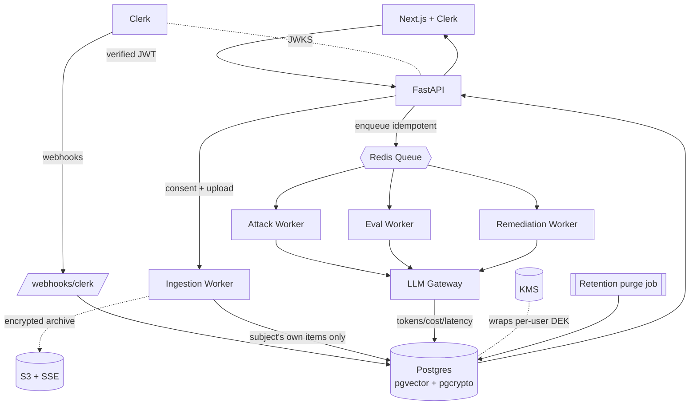

# Architecture

> ⚠️ **SUPERSEDED / ARCHIVED.** Split into and replaced by the granular tree — see `02-architecture/*` (authoritative; richer — it adds the LiteLLM Proxy, the VLM path, connectors, and media/EXIF that this flat draft predates). Kept for historical provenance only; **do not build from this file.** Migration map: `00-index.md`.

Cloud, service-oriented, async-first. (Historical draft.)

## Components

| Layer | Component | Responsibility |
|---|---|---|
| Client | Next.js + Clerk | Upload/connect, consent, dashboard, attribution heatmap, attack→defend simulation |
| Edge | Clerk | Identity provider; issues session JWTs |
| API | FastAPI | Verifies Clerk JWT (JWKS), authz, orchestrates runs, serves results, export/erasure |
| Webhooks | `/webhooks/clerk` | `user.created/deleted`, membership sync |
| Async | Redis + `arq` | Queue for all long-running LLM work |
| Workers | ingestion / attack / eval / remediation / purge | Stage execution + retention |
| Service | LLM gateway | Sole egress to the cloud LLM; records tokens/cost/latency; model routing |
| Data | Postgres + pgvector + pgcrypto | Primary store, embeddings, field-level encryption |
| Data | Object storage (S3 + SSE) *(optional)* | Encrypted original archives, or process-then-discard |
| Security | KMS | Wraps per-user DEKs; enables crypto-shred |

## Diagram



## Async run lifecycle

State machine for every `run`:

```
queued ──► running ──► succeeded
                  └──► failed ──► (retry w/ backoff) ──► running
                  └──► canceled
```

- Enqueue is **idempotent** via `runs.idempotency_key`.
- API creates the run (`202 Accepted` + `run_id`); client polls `GET /runs/{id}` or subscribes via SSE.
- Workers record `attempts`, terminal `error`, and emit `run_metrics`.
- Terminal failures route to a dead-letter list for inspection.

### Stage data flow
- **Attack:** upload → consent check → ingest (own items, encrypted) → enqueue `attack` → per-attribute inference → `inferences` → dashboard.
- **Measure:** SynthPAI seeded once → `eval` run → compare to `eval_labels` → `eval_results`.
- **Defend:** user triggers `remediation` → anonymizer rewrites/flags → **re-attack** → store `confidence_before/after` → simulation view.

## Trust boundaries
- The **LLM gateway** is the only path that sends decrypted (in-memory) content outside the VPC, to a documented sub-processor. It never logs or persists that content.
- `data_keys` sits behind a privileged role; the app role reaches plaintext only via the `SECURITY DEFINER` decrypt function.
- All inter-service calls stay inside the VPC; only the Next.js app and webhook endpoint are public.

## Deployment (weekend-friendly target)
- **Frontend:** Vercel.
- **API + workers:** Railway / Render / Fly.io (one service for API, one for the `arq` worker).
- **DB:** managed Postgres with encryption at rest + `pgvector`, `pgcrypto`.
- **Redis:** managed instance for the queue.
- **KMS:** cloud KMS (or, for the MVP, a single env-provided master key with a clear note to upgrade to KMS).

## Scaling notes (post-MVP)
- Workers scale horizontally per stage; the queue decouples API latency from LLM latency.
- Model routing in the gateway (cheap model for low-signal items, strong model for ambiguous) is the main cost lever; `run_metrics` drives those decisions.
